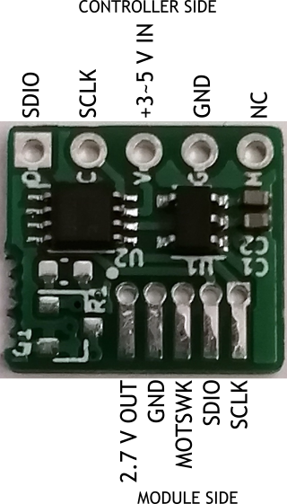

# LevelConverterForTrackballModule

## 概要
トラックボールモジュール用のレベル変換基板です。

2.7Vのレギュレーターと双方向レベル変換ICを搭載しており、トラックボールモジュールに電源供給するとともにPro Microなどのコントローラーにあわせて信号をレベル変換します。

通信にはPro MicroやBLE Micro Proの任意の2ピンを使います。他の機能とピンを共有する場合はデータシートの通信プロトコルの仕様をみて混在できるか確認してください。

自作キーボードのOLED用のピンソケットに差し込んで通信できるようにコントローラ側のピンを配置してあります。ただし、OLED（I2C通信)とのバスの共用は出来ません。

## サンプルプログラム
[Pro Micro用](https://github.com/sekigon-gonnoc/qmk_firmware/tree/dev/ble_micro_pro/keyboards/helix/rev2/keymaps/bto_tb)  
[BLE Micro Pro用](https://github.com/sekigon-gonnoc/qmk_firmware/tree/dev/ble_micro_pro/keyboards/ble_micro_pro/keymaps/bto_tb)
